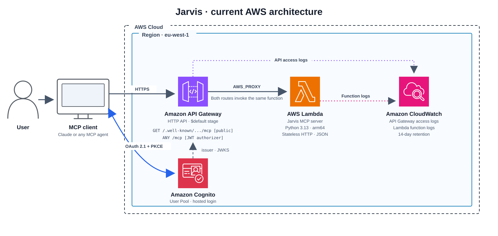

# Jarvis

Jarvis is an intelligent task and time management system designed to turn conversations into realistic, actionable plans.

The goal is to provide a conversational interface through which users can manage their tasks, organize their time, and plan their day or week intelligently.

Jarvis should be able to answer questions such as:

* What do I have scheduled for tomorrow?
* I need to complete tasks A, B, and C. Help me estimate how long they will take and schedule them throughout the week.
* My boss has scheduled an urgent meeting for tomorrow. How should I reorganize the tasks I had planned for that day?

Jarvis runs on AWS and exposes its capabilities through the [Model Context Protocol](https://modelcontextprotocol.io). This makes the conversational interface deliberately interchangeable: any MCP-compatible agent can connect to Jarvis, and Jarvis neither knows nor needs to know which agent is calling it.

Jarvis owns the task state, planning logic, scheduling decisions, and external integrations.


## Architecture



An MCP client connects in three steps, and the split between the two routes is the part worth understanding:

1. **Discover.** The client calls `/mcp` with no token and API Gateway refuses it. The refusal carries no hint about where to authenticate — a JWT authorizer is a managed component and its `401` cannot be customised — so the client falls back to reading a metadata document at a conventional path. That document names the authorization server. It is the only place the link between this API and its user pool is written down, and it is served without authentication by necessity: a client with no token has to be able to read it, or it would need a token to discover how to obtain one.
2. **Log in.** The client opens the user pool's hosted login in a browser and the user authenticates. OAuth 2.1 with PKCE; no machine-to-machine grant, so every connection involves a real person once. Access tokens last an hour, refresh tokens thirty days, and refreshes are silent.
3. **Call tools.** Requests to `/mcp` carry a bearer token. API Gateway validates the signature, issuer and audience before invoking anything, so an unauthenticated request costs nothing and never reaches application code.

Both routes resolve to the same function; the MCP SDK routes by path internally.

## What runs today

| Piece | Detail |
| --- | --- |
| Front door | API Gateway HTTP API. Throttled at 10 burst / 5 rps, shared across both routes |
| Compute | Lambda on Python 3.13 / arm64, running the official `mcp` SDK over Mangum |
| Transport | Streamable HTTP, stateless, JSON responses — no SSE, no server-side sessions |
| Identity | Cognito user pool. Administrator-created users only, no self-registration |
| Authorization | API Gateway JWT authorizer on `ANY /mcp`; the metadata route stays public |
| Observability | CloudWatch Logs for the function, plus API Gateway access logs that record requests the authorizer rejected before any invocation |
| Tools | One: `hello`, a placeholder that returns a greeting |

Cold start is roughly two seconds — the cost of importing the SDK and pydantic — and warm invocations land in single-digit milliseconds.

## Running it

Every operation goes through the Makefile, which is the single source of truth for region and resource names. Run `make` with no target for the list.

```sh
make init                              # download the terraform providers, once per clone
make plan                              # preview changes
make apply                             # create or update
make create-user EMAIL=you@example.com # bootstrap a user; not idempotent, kept out of apply
make list-users
make url
make destroy
```

`terraform destroy` takes the user pool with it, and the users inside it go too — they are created through the AWS CLI rather than declared as resources, so they never appear in a plan and an apply does not bring them back. See the note at the top of `infra/main.tf`.

## Updating the diagram

The README renders `docs/architecture.svg` directly. Edit that vector file in a compatible design tool when the deployed architecture changes. `docs/architecture.png` is retained as a raster export; the earlier `docs/architecture.py` generator remains in the repository for reference but no longer controls the README diagram.

## Planned

None of the following is built yet. The current deployment is the transport and authorization boundary with a placeholder tool behind it.

- Capture, organize, and track tasks through natural conversation.
- Prioritize work using deadlines, importance, effort, and available time.
- Turn priorities into practical time blocks instead of leaving them as a flat task list.
- Read availability from Google Calendar and schedule focused work around existing commitments.
- Reschedule unfinished tasks when plans change.
- Surface overdue work, scheduling conflicts, and unrealistic workloads.
- Support daily planning, weekly reviews, and progress tracking.

The intended shape keeps the language model as the interface and reasoning layer without making it the source of truth: a task and planning engine owns the business rules, a store keeps state and history, and Google Calendar provides real availability and receives approved time blocks. State changes, permissions, validation, and integrations stay in the application.

## Project status

Jarvis is in early development.

The MCP boundary is deployed, authenticated, and verified end to end from a real client. 

Persistent storage, the planning engine, and the Google Calendar integration are next, and none of them exist yet.
