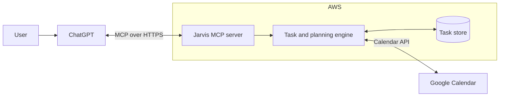

# Jarvis

Jarvis is an intelligent task and time management system designed to turn conversations into realistic plans for the day.

It will run on AWS and expose its capabilities to ChatGPT through the Model Context Protocol (MCP). ChatGPT will be the conversational interface, while Jarvis will own the task state, planning logic, and external integrations.

The goal is not to build another to-do list. Jarvis should help answer questions such as: What should I work on next? What can realistically fit into today? Which tasks are becoming urgent? What needs to be rescheduled?

## Capabilities

Jarvis is being designed to:

- Capture, organize, and track tasks through natural conversation.
- Prioritize work using deadlines, importance, effort, and available time.
- Turn priorities into practical time blocks instead of leaving them as a flat task list.
- Read availability from Google Calendar and schedule focused work around existing commitments.
- Reschedule unfinished tasks when plans change.
- Surface overdue work, scheduling conflicts, and unrealistic workloads.
- Support daily planning, weekly reviews, and progress tracking.

## Architecture

ChatGPT interprets the user's intent and calls focused tools exposed by the MCP server. The task and planning engine owns the business rules: task lifecycle, priorities, deadlines, scheduling constraints, and time-blocking decisions. Google Calendar provides real availability and receives approved time blocks, while the task store keeps the underlying state and history.

This separation keeps the language model as the interface and reasoning layer without making it the source of truth. State changes, permissions, validation, and integrations remain controlled by the application running in AWS.

## Project status

Jarvis is in early development. The current focus is defining the task domain and the MCP boundary. AWS deployment, persistent storage, and Google Calendar integration are part of the planned system and are not production-ready yet.
